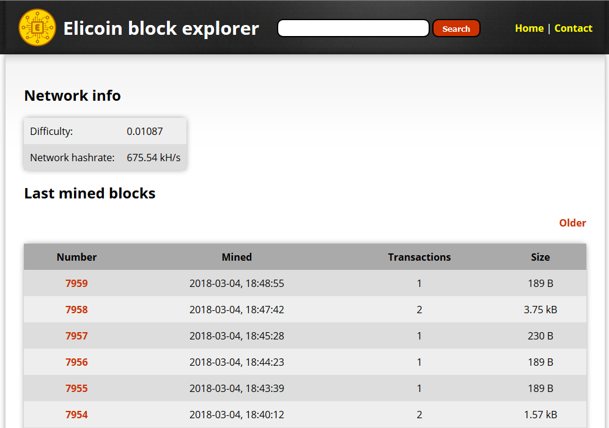

# Elicoin Block Explorer
**Elicoin Block Explorer** is a JSON-RPC based web blockchain explorer made in PHP. It is designed for Elicoin, but it should be working with other Bitcoin / Litecoin Core based wallets too.

## Installation
1. Install Web server with PHP (tested on Apache with PHP 5.6, but it should be working on any other)
2. Install [Elicoin Core wallet](https://github.com/elicoin/elicoin/releases/)
3. Download all files in **src** folder from this GitHub project and put it in your web root
4. Create **elicoin.conf** in your Elicoin data folder (if not exists already) and put these lines in this file:
```
rpcuser=YOUR_USERNAME
rpcpassword=YOUR_VERY_STRONG_PASSWORD
rpcport=9999
```
5. Edit **config.php** file and set the same **user** and **pass** variables as in **elicoin.conf**
6. Run Elicoin Core wallet under root: **sudo elicoind -daemon -reindex -txindex**
7. Wait for indexing (might take few minutes)
8. Done!

**Warning:** Always use Elicoin Core wallet with 0 ELI balance for Block explorer, otherwise someone can steal it from you!

## Screenshot

<p align="center">
 
</p>

## License
Elicoin GUI Miner is open source software developed under [**MIT license**](./LICENSE).
